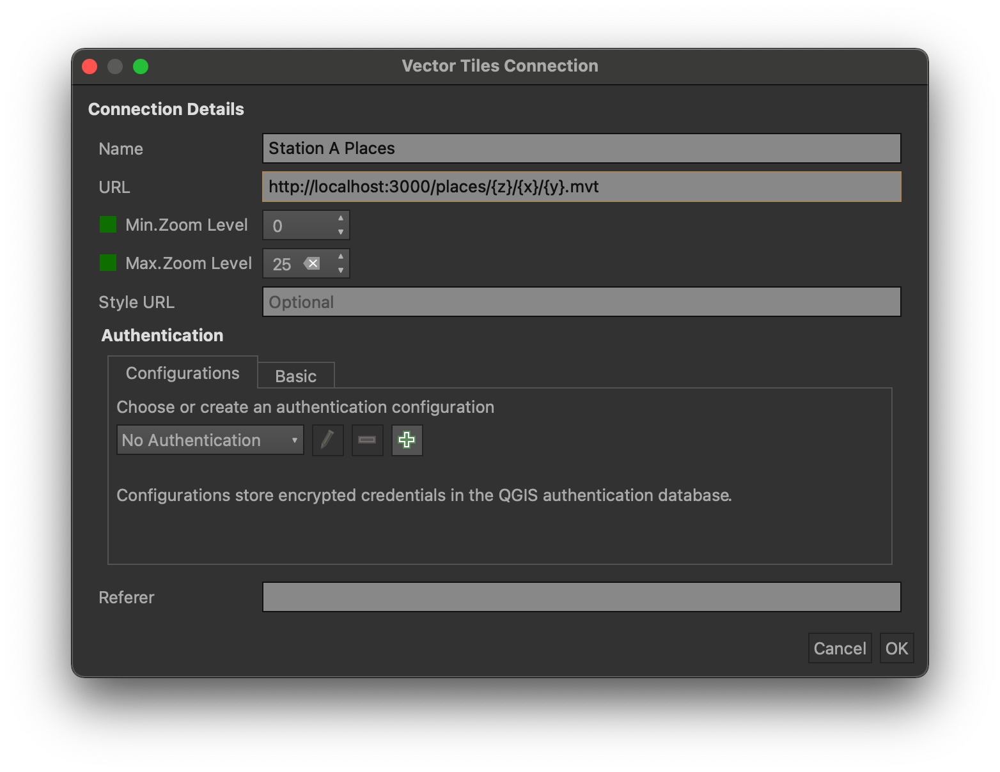

# tilenol [](https://godoc.org/github.com/StationA/tilenol) [](https://goreportcard.com/report/github.com/stationa/tilenol) [](https://travis-ci.com/StationA/tilenol) [](https://hub.docker.com/repository/docker/stationa/tilenol)

Tilenol is a scalable web server for serving geospatial data stored in
[multiple supported backends](#supported-backends) as Mapbox Vector Tiles.

## Installation

Navigate to the root `tilenol/` directory (where the `Makefile` is located) and run:

```
make install
```

## Usage

### `tilenol`

```
usage: tilenol [<flags>] <command> [<args> ...]

Flags:
  --help  Show context-sensitive help (also try --help-long and --help-man).

Commands:
  help [<command>...]
    Show help.

  run [<flags>]
    Runs the Tilenol server

  version
    Prints out the version
```

### `tilenol run`

```
usage: tilenol run [<flags>]

Runs the Tilenol server

Flags:
      --help                 Show context-sensitive help (also try --help-long and --help-man).
  -d, --debug                    Enable debug mode
  -f, --config-file=tilenol.yml  Server configuration file
  -p, --port=3000                Port to serve tiles on
  -i, --internal-port=3001       Port for internal metrics and healthchecks
  -x, --enable-cors              Enables cross-origin resource sharing (CORS)
  -s, --simplify-shapes          Simplifies geometries based on zoom level
  -n, --num-processes=0          Sets the number of processes to be used
```

### Configuration

```yaml
# Cache configuration (optional)
cache:
  redis:
    host: localhost
    port: 6379
    ttl: 24h
# Layer configuration
layers:
  - name: buildings
    minzoom: 14
    source:
      elasticsearch:
        host: localhost
        port: 9200
        index: buildings
        geometryField: geometry
        sourceFields:
          area_sqft: building.area_sqft
          height_ft: building.height_ft
```

### Docker

Tilenol is also available as
[`stationa/tilenol` on DockerHub](https://hub.docker.com/repository/docker/stationa/tilenol). This
can be helpful when running in cloud environments or on Kubernetes:

```bash
# To run the Docker image on your machine, you can use the following:

docker run \
  --rm \
  -it \
  -p 3000:3000 \
  -v my-tilenol-conf.yml:/conf/tilenol.yml \
  stationa/tilenol \
  run -p 3000 -f /conf/tilenol.yml

# Note that this will bind tilenol to your local port 3000, and requires a configuration file to be
# mounted at the /conf/tilenol.yml path
```

Currently, the Docker image tags are published according to the following scheme:

- `vM.m.p` is the image built for the exact SemVer major/minor/patch version `M.m.p`, e.g. `v1.0.7`
- `vM` is the latest image available for the given SemVer major version number `M`, e.g. `v1`
- `latest` is the latest stable image available
- `devel` is the latest unstable image available based on the last commit made to the `main` branch

We recommend you use either `vM` or `vM.m.p` where possible, though your appetite for risk may vary
by use case.

## Supported backends

Currently, tilenol supports the following data backends:

- [Elasticsearch](examples/elasticsearch/)
- [PostGIS](examples/postgis/)

## QGIS support

Tilenol layers can also be viewed in GIS software such as QGIS.

Instructions for adding a Tilenol layer to QGIS 3.16:

1. Navigate to Layer > Add Layer > Add Vector Tile Layer
1. Click on New, and then Create a New Generic Connection
1. Configure the Connection Details, for example:
1. Name: Places
1. URL: http://localhost:3000/places/{z}/{x}/{y}.mvt
1. Min.Zoom Level: 0
1. Max.Zoom Level: 25

Example screenshot, pointing QGIS to a locally running instance of Tilenol:



1. Click OK and then Add
1. You should be able to see the Tilenol places layer at appropriate zoom levels

## Contributing

When contributing to this repository, please follow the steps below:

1. Fork the repository
1. Submit your patch in one commit, or a series of well-defined commits
1. Submit your pull request and make sure you reference the issue you are addressing
