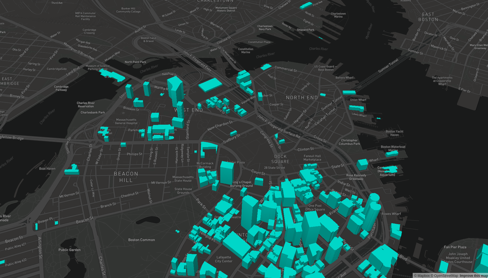

# Tilenol examples

This directory contains a few examples for how to use tilenol with various backend layer sources:

- [elasticsearch/](elasticsearch)
- [postgis/](postgis)

## How to try the examples

Each of the example directories has their own instructions on how to run a local tilenol server
configured to talk to a specific data backend. But to actually test that tilenol is working, you can
open the included [index.html](index.html) file to see how MapBox GL renders the tiles themselves:

In order to make this work, you must include your MapBox access token in the query string of the
page URL (or you can modify the `index.html` file to include it directly, but be careful not to
accidentally check it in!).
